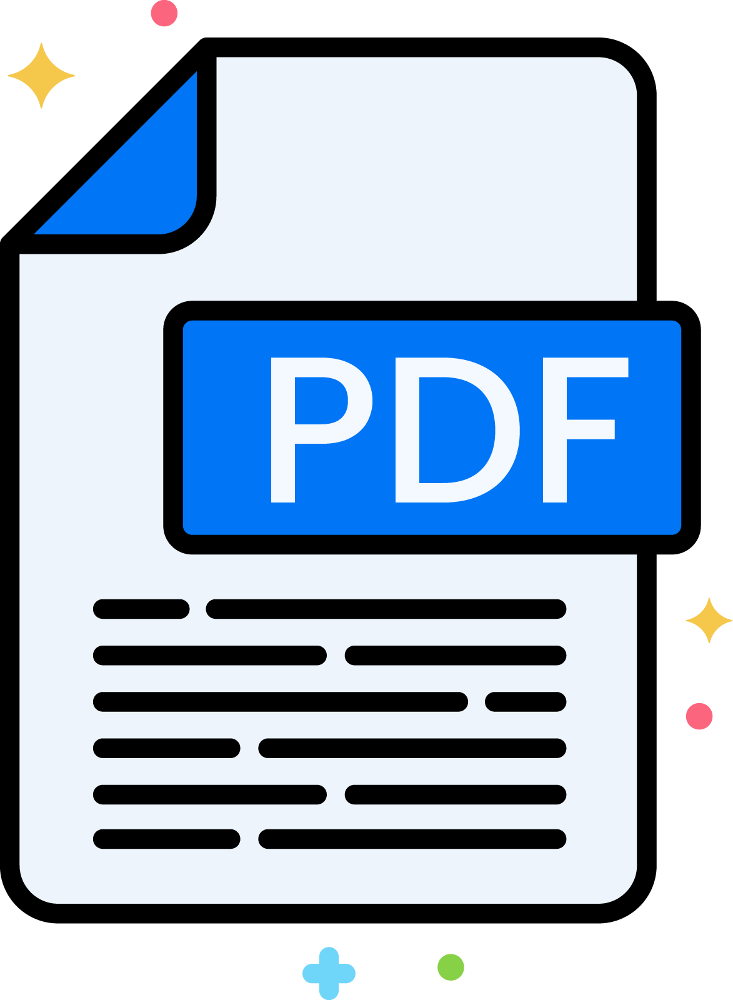

# PDF Chest UI

**_This is a Simple App UI for PDF Chest App in Play Store._**

## [PDFChestUI](https://pdfchest.netlify.app/)

### Description:

### Creator:

-   **[Niloy Sikdar](https://github.com/niloysikdar) : [Play Store Repo](https://github.com/niloysikdar/PdfChest)**

-   **[Niladri Mondal](https://github.com/imniladri) : [Web UI Repo](https://github.com/imniladri/PDFChestUI)**

### Version:

-   **[Play Store Version](https://play.google.com/store/apps/details?id=com.pdfchest.android)**
-   **[Web UI Version](https://imniladri.github.io/PDFChestUI/)**

 

**_Thanks_**
